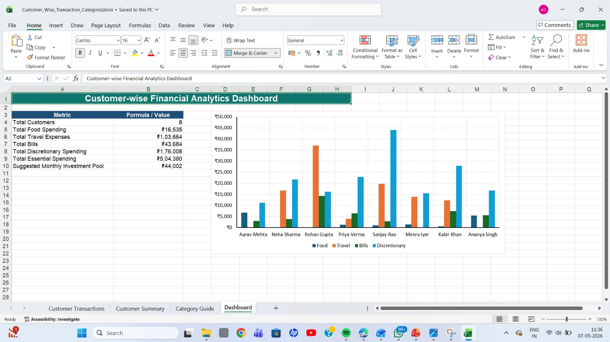

# 📊 Excel Dashboard & Business Analytics Project

This repository contains Excel-based dashboards and business analytics reports designed for data visualization, reporting, and business insights.

## 📌 Project Overview

This project demonstrates how Excel can be used to create:
- Interactive dashboards
- Customer summaries
- Category-based analytical reports
- Business insights for decision-making

## 🛠 Tools Used

- Microsoft Excel
- Pivot Tables
- Charts & Graphs
- Conditional Formatting
- Data Cleaning
- Dashboard Design

---

## 📷 Project Screenshots

### Dashboard


### Category Guide


### Customer Summary


---

## 📂 Files Included

- `Dashboard.jpeg` → Main dashboard preview
- `category_guide.jpeg` → Category analysis view
- `customer_summary.jpeg` → Customer analytics summary

---

## 🚀 How to Use

1. Clone this repository
2. Open project files in Microsoft Excel
3. Explore dashboards and analytics reports

```bash
git clone https://github.com/your-username/Excel.git
```

---

## 📄 License

This project is licensed under the MIT License.
